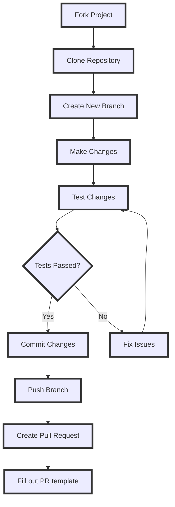

# How to Contribute?

## Testing

* Test the latest changes to WinUtil by running the pre-release and reporting issues you are encountering to help us continually improve WinUtil!

#### **Run the latest pre-release**
   ```ps1
   irm https://christitus.com/windev | iex
   ```

!!! bug "Keep in mind"

     This is a pre-release and should be treated as such. It exists for developers to test the utility and report or fix bugs before they get added to the stable release. Don't use it in production!

## Issues

* If you encounter any challenges or problems with the script, I kindly request that you submit them via the "Issues" tab on the GitHub repository. By filling out the provided template, you can provide specific details about the issue, allowing me (and others in the community) to promptly address any bugs or consider feature requests.

## Contribute Code

* Pull requests are now handled directly on the **MAIN branch**. This was done since we can now select specific releases to launch via releases in GitHub.

* If you're doing code changes, then you can submit a PR to `main` branch, but I am very selective about these.

!!! warning "Important"

     Do not use a code formatter, make massive amounts of line changes, or make multiple feature changes. EACH FEATURE CHANGE SHOULD BE IT'S OWN PULL REQUEST!

* When creating pull requests, it is essential to thoroughly document all changes made. This includes, but is not limited to, documenting any additions made to the `tweaks` section and corresponding `undo tweak`, so users are able to remove the newly added tweaks if necessary, and comprehensive documentation is required for all code changes. Document your changes and briefly explain why you made your changes in your Pull Request Description. Failure to adhere to this format may result in the denial of the pull request. Additionally, any code lacking sufficient documentation may also be denied.

* By following these guidelines, we can maintain a high standard of quality and ensure that the codebase remains organized and well-documented.

!!! note

     When creating a function, please include "WPF" or "WinUtil" in the file name so it can be loaded into the runspace.

## Walk through

* This is a guide for beginners. If you are still having issues, look at the following official GitHub documentation:
    * [Commit through WEB](https://docs.github.com/en/pull-requests/committing-changes-to-your-project/creating-and-editing-commits/about-commits)
    * [Commit through GitHub Desktop](https://docs.github.com/en/desktop/making-changes-in-a-branch/committing-and-reviewing-changes-to-your-project-in-github-desktop#about-commits)
    * [Create a Pull Request](https://docs.github.com/en/pull-requests/collaborating-with-pull-requests/proposing-changes-to-your-work-with-pull-requests/creating-a-pull-request)


### Overview


!!! info

     This is a diagram to guide you through the process. It may vary depending on the type of change you're making.

### Fork the Repo
* Fork the WinUtil Repository [here](https://github.com/ChrisTitusTech/winutil) to create a copy that will be available in your repository list.


### Clone the Fork
!!! tip

     While you can make your changes directly through the Web, we recommend cloning the repo to your device using the application GitHub Desktop (available in WinUtil) to test your fork easily.

* Install GitHub Desktop if it is not already installed.
* Log in using the same GitHub account you used to fork WinUtil.
* Choose the fork under "Your Repositories" and press "clone {repo name}"
* Create a new branch and name it something relatable to your changes.

* Now you can modify WinUtil to your liking using your preferred text editor.


### Testing your changes

* To test to see if your changes work as intended run following commands in a powershell terminal as admin:

* Change the directory where you are running the commands to the forked project.
* `cd {path to the folder with the compile.ps1}`
* Run the following command to compile and run WinUtil:
* `.\Compile.ps1 -run`


* After seeing that your changes work properly, feel free to commit the changes to the repository and make a PR. For help on that, follow the documentation below.

### Committing the changes
* Before committing your changes, please discard changes made to the `winutil.ps1` file, like the following:


* Now, commit your changes once you are happy with the result.


* Push the changes to upload them to your fork on github.com.


### Making a PR
* To make a PR on your repo under a new branch linking to the main branch, a button will show and say Preview and Create pull request. Click that button and fill in all the information that is provided on the template. Once all the information is filled in correctly, check your PR to make sure there is not a WinUtil.ps1 file attached to the PR. Once everything is good, make the PR and wait for Chris (the maintainer) to accept or deny your PR. Once it is accepted by Chris, you will be able to see your changes in the "/windev" build.
* If you do not see your feature in the main "/win" build, that is fine. All new changes go into the /windev build to make sure everything is working OK before going fully public.
* Congratulations! You just submitted your first PR. Thank you so much for contributing to WinUtil.
