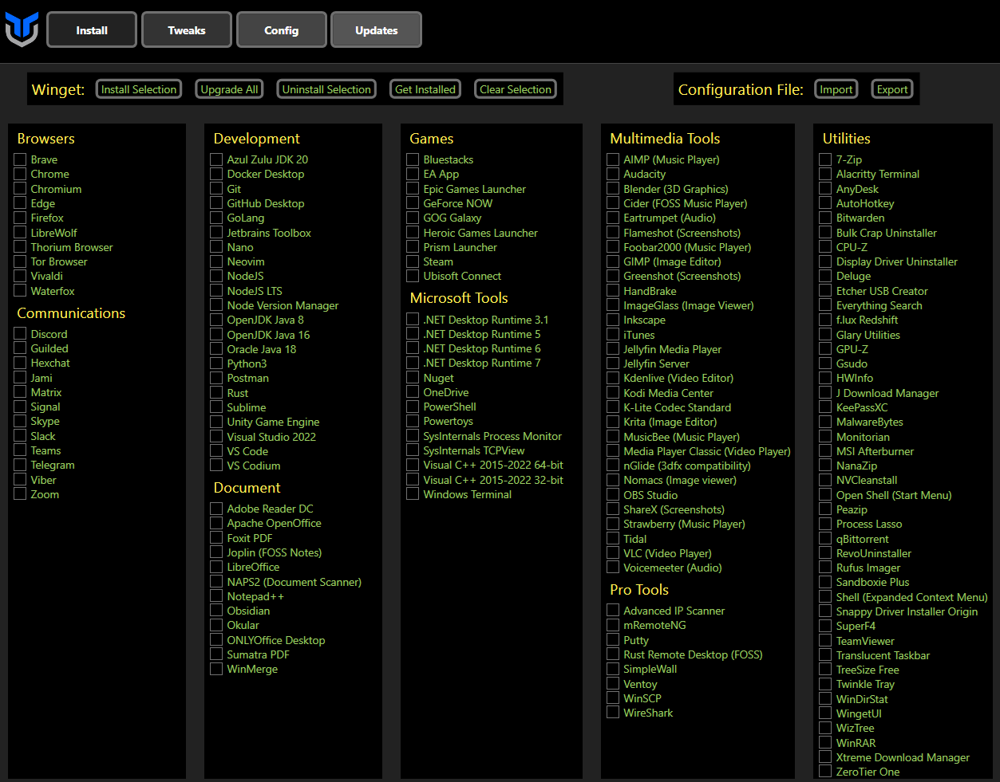

# Chris Titus Tech's Windows Utility

[](https://github.com/ChrisTitusTech/winutil/releases/latest)

This utility is a compilation of Windows tasks I perform on each Windows system I use. It is meant to streamline *installs*, debloat with *tweaks*, troubleshoot with *config*, and fix Windows *updates*. I am extremely picky about any contributions to keep this project clean and efficient.



## Usage

Winutil must be run in Admin mode because it performs system-wide tweaks. To achieve this, open PowerShell or Windows Terminal as an administrator. Here are a few ways to do it:

1. **Right-Click Method:**
   - Right-click on the start menu.
   - Choose "Windows PowerShell (Admin)" (for Windows 10) or "Terminal (Admin)" (for Windows 11).

2. **Search and Launch Method:**
   - Press the Windows key.
   - Type "PowerShell" or "Terminal" (for Windows 11).
   - Press `Ctrl + Shift + Enter` to launch it with administrator privileges.


### Launch Command

#### Simple way

```ps1
irm "https://christitus.com/win" | iex
```
Courtesy of the issue: [#144](/../../issues/144)

If this site is not reachable from your country, please try running it directly from GitHub.
```ps1
irm "https://github.com/ChrisTitusTech/winutil/releases/latest/download/winutil.ps1" | iex
```

If you still have Issues, refer to [Known Issues](https://github.com/ChrisTitusTech/winutil/blob/main/KnownIssues.md).


#### Automation

Some features are available through automation. This allows you to save your config file pass it to Winutil walk away and come back to a finished system. Here is how you can set it up currently with Winutil >24.01.15

1. On the Install Tab, click "Get Installed", this will get all installed apps **supported by Winutil** on the system
  
2. Click on the Settings cog in the upper right corner and chose Export, chose file file and location, this will export the setting file.
  
3. Copy this file to a USB or somewhere you can use after Windows installation.
4. Use Microwin tab to create a custom Windows image.
5. Install the Windows image.
6. In the new Windows, Open PowerShell in the admin mode and run command to automatically apply tweaks and install apps from the config file.
```
iex "& { $(irm christitus.com/win) } -Config [path-to-your-config] -Run"
```
7. Have a cup of coffee! Come back when it's done.


## Support
- To morally and mentally support the project, make sure to leave a ⭐️!
- EXE Wrapper for $10 @ https://www.cttstore.com/windows-toolbox

## Tutorial

[](https://www.youtube.com/watch?v=6UQZ5oQg8XA)

## Overview

- Install
  - Install Selection: Organize programs by category and facilitate installation by enabling users to select programs and initiate the installation process with a single click.

  - Upgrade All: Upgrade all existing programs to their latest versions, ensuring users have the most up-to-date and feature-rich software.

  - Uninstall Selection: Effortlessly uninstall selected programs, providing users with a streamlined way to remove unwanted software from their system.

  - Get Installed: Retrieve a comprehensive list of installed programs on the system, offering users visibility into the software currently installed on their computer.

  - Import / Export: Enable users to import or export the selection list of programs, allowing them to save their preferred program configurations or share them with others. This feature promotes convenience and flexibility in managing program selections across different systems.

- Tweaks
  - Recommended Selection: Provides pre-defined templates tailored for desktop, laptop, and minimal configurations, allowing users to select recommended settings and optimizations specific to their system type.

  - Essential Tweaks: Offers a collection of essential tweaks aimed at improving system performance, privacy, and resource utilization. These tweaks include creating a system restore point, disabling telemetry, Wi-Fi Sense, setting services to manual, disabling location tracking, and HomeGroup, among others.

  - Advanced Tweaks: Encompasses a range of various advanced power user tweaks to further optimize the system. These tweaks include removing OneDrive and Edge, disabling User Account Control (UAC), notification panel, among others.

  - Toggles: Adds easy to use, one click shortcuts for toggling dark mode, NumLock on startup, file extensions, sticky keys, among others.

  - Additional Tweaks: Introduces various other tweaks such as enabling dark mode, changing DNS settings, adding an Ultimate Performance mode, and creating shortcuts for WinUtil tools. These tweaks provide users with additional customization options to tailor their system to their preferences.

- Config
  - Features: Allows users to easily install various essential components and features to enhance their Windows experience. These features include installing .NET Frameworks, enabling Hyper-V virtualization, enabling legacy media support for Windows Media Player and DirectPlay, enabling NFS (Network File System) for network file sharing, and enabling Windows Subsystem for Linux (WSL) for running Linux applications on Windows.

  - Fixes: Provides a range of helpful fixes to address common issues and improve system stability. This includes setting up autologon for seamless login experiences, resetting Windows updates to resolve update-related problems, performing a system corruption scan to detect and repair corrupted files, and resetting network settings to troubleshoot network connectivity issues.

  - Legacy Windows Panels: Includes access to legacy Windows panels from Windows 7, allowing users to access familiar and powerful tools. These panels include Control Panel for managing system settings, Network Connections for configuring network adapters and connections, Power Panel for adjusting power and sleep settings, Sound Settings for managing audio devices and settings, System Properties for viewing and modifying system information, and User Accounts for managing user profiles and account settings.


- Updates:
  - Default (Out of Box) Settings: Provides the default settings that come with Windows for updates.

  - Security (Recommended) Settings: Offers recommended settings, including a slight delay of feature updates by 2 years and installation of security updates 4 days after release.

  - Disable All Updates (Not Recommended!): Allows users to disable all Windows updates, but it's not recommended due to potential security risks.


Video and Written Article walkthrough @ <https://christitus.com/windows-tool/>

## Contributing Guidelines

If you encounter any challenges or problems with the script, or want to contribute code to the project, please consider reading through our [Contributing Guidelines](./CONTRIBUTING.md)

## Thanks to all Contributors
Thanks a lot for spending your time helping Winutil grow. Thanks a lot! Keep rocking 🍻.

[](https://github.com/ChrisTitusTech/winutil/graphs/contributors)

## GitHub Stats


