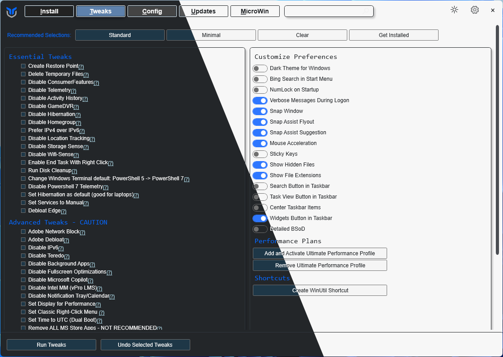

# Chris Titus Tech's Windows Utility

[](https://github.com/ChrisTitusTech/winutil/releases/latest)

[](https://discord.gg/RUbZUZyByQ)

This utility is a compilation of Windows tasks I perform on each Windows system I use. It is meant to streamline *installs*, debloat with *tweaks*, troubleshoot with *config*, and fix Windows *updates*. I am extremely picky about any contributions to keep this project clean and efficient.



## 💡 Usage

Winutil must be run in Admin mode because it performs system-wide tweaks. To achieve this, run PowerShell as an administrator. Here are a few ways to do it:

1. **Start menu Method:**
   - Right-click on the start menu.
   - Choose "Windows PowerShell (Admin)" (for Windows 10) or "Terminal (Admin)" (for Windows 11).

2. **Search and Launch Method:**
   - Press the Windows key.
   - Type "PowerShell" or "Terminal" (for Windows 11).
   - Press `Ctrl + Shift + Enter` or Right-click and choose "Run as administrator" to launch it with administrator privileges.

### Launch Command

#### Stable Branch (Recommended)

```ps1
irm "https://christitus.com/win" | iex
```
#### Dev Branch

```ps1
irm "https://christitus.com/windev" | iex
```

If you have Issues, refer to [Known Issues](https://christitustech.github.io/winutil/KnownIssues/)

## 🎓 Documentation

### [WinUtil Official Documentation](https://christitustech.github.io/winutil/)

### [YouTube Tutorial](https://www.youtube.com/watch?v=6UQZ5oQg8XA)

### [ChrisTitus.com Article](https://christitus.com/windows-tool/)

## 💖 Support
- To morally and mentally support the project, make sure to leave a ⭐️!
- EXE Wrapper for $10 @ https://www.cttstore.com/windows-toolbox

## 💖 Sponsors

These are the sponsors that help keep this project alive with monthly contributions.

<!-- sponsors --><a href="https://github.com/ysaito8015"></a><a href="https://github.com/TriHydera"></a><a href="https://github.com/jozozovko"></a><a href="https://github.com/DelDongo"></a><a href="https://github.com/markamos"></a><a href="https://github.com/dwelfusius"></a><a href="https://github.com/mews-se"></a><a href="https://github.com/jdiegmueller"></a><a href="https://github.com/AlanTristar"></a><a href="https://github.com/zepled112"></a><a href="https://github.com/altugtekiner"></a><a href="https://github.com/robertsandrock"></a><a href="https://github.com/mmomega"></a><a href="https://github.com/KenichiQaz"></a><a href="https://github.com/thaddl"></a><a href="https://github.com/paulsheets"></a><a href="https://github.com/djones369"></a><a href="https://github.com/anthonymendez"></a><a href="https://github.com/xBandaku"></a><a href="https://github.com/claudemods"></a><a href="https://github.com/FatBastard0"></a><a href="https://github.com/tcookj66"></a><a href="https://github.com/issacs-tech"></a><a href="https://github.com/DursleyGuy"></a><a href="https://github.com/defiling9046"></a><a href="https://github.com/samithseu"></a><a href="https://github.com/YamiSandman616"></a><a href="https://github.com/Lineax17"></a><!-- sponsors -->

## 🏅 Thanks to all Contributors
Thanks a lot for spending your time helping Winutil grow. Thanks a lot! Keep rocking 🍻.

[](https://github.com/ChrisTitusTech/winutil/graphs/contributors)

## 📊 GitHub Stats


