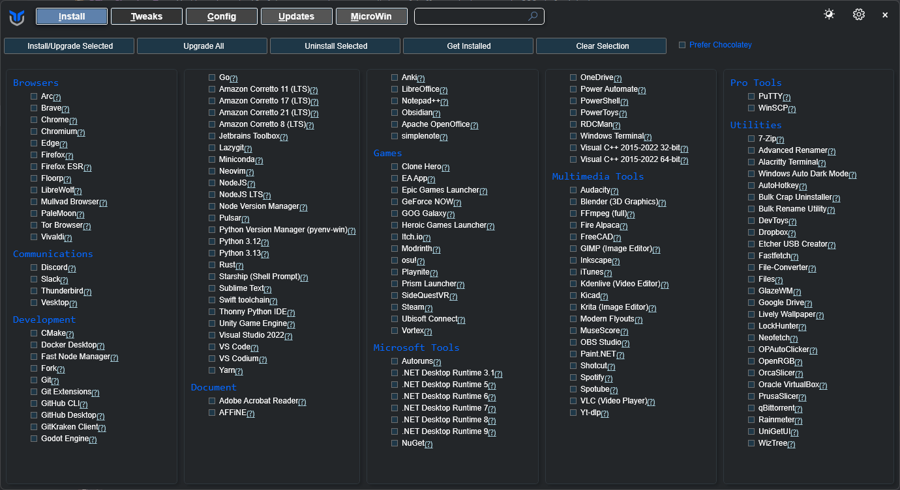

# RealCrayfish's Custom Config for ChrisTitusTech's winutil

This is a custom configuration for ChrisTitusTech's winutil tool. I have removed and added some tools from winutil to make it more usable for me.

## 💡 Usage

To use this configuration, you can either download a prebuilt PowerShell script or compile it yourself. The prebuilt script can be run in the same way as the original winutil, instructions can be found [here](https://github.com/ChrisTitusTech/winutil).

Compilation Steps:

1. Download winutil from the [official GitHub repo](https://github.com/ChrisTitusTech/winutil) and the configuration from the releases tab on this repo or get the [latest here](https://github.com/RealCrayfish/WinutilConfig/releases/latest/).
2. Move and extract the configuration archive into the winutil root directory using a tool like 7zip. It should ask you to replace files, click 'Yes to All', if this does not appear you have likely done something wrong.
3. Run `Compile.ps1`.
4. The output should be a single file named `winutil.ps1`

## 💖 Support
- If you like this tool, make sure to star both this config and winutil ⭐
- Check out [Chris Titus Tech's winutil](https://github.com/ChrisTitusTech/winutil).
