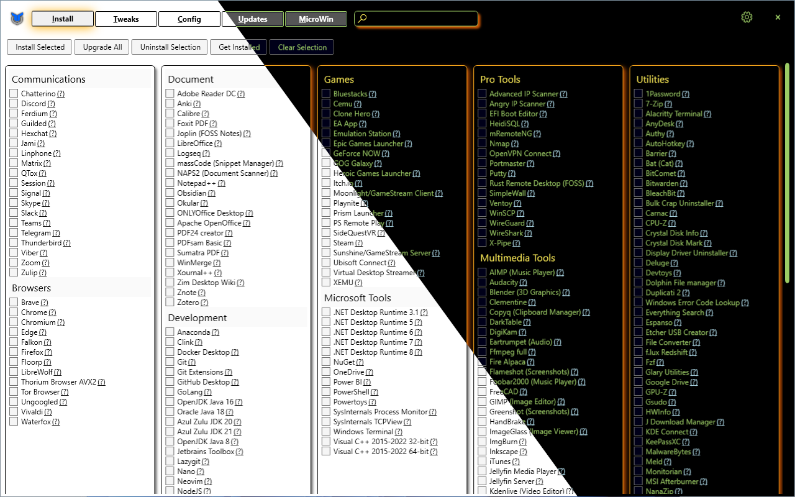

# Chris Titus Tech's Windows Utility

[](https://github.com/ChrisTitusTech/winutil/releases/latest)
[](https://github.com/ChrisTitusTech/winutil/releases/latest)


This utility is a compilation of Windows tasks I perform on each Windows system I use. It is meant to streamline *installs*, debloat with *tweaks*, troubleshoot with *config*, and fix Windows *updates*. I am extremely picky about any contributions to keep this project clean and efficient.



## 💡 Usage

Winutil must be run in Admin mode because it performs system-wide tweaks. To achieve this, open PowerShell or Windows Terminal as an administrator. Here are a few ways to do it:

1. **Right-Click Method:**
   - Right-click on the start menu.
   - Choose "Windows PowerShell (Admin)" (for Windows 10) or "Terminal (Admin)" (for Windows 11).

2. **Search and Launch Method:**
   - Press the Windows key.
   - Type "PowerShell" or "Terminal" (for Windows 11).
   - Press `Ctrl + Shift + Enter` to launch it with administrator privileges.


### Launch Command

#### Simple way

```ps1
irm "https://christitus.com/win" | iex
```
Courtesy of the issue: [#144](/../../issues/144)

If this site is not reachable from your country, please try running it directly from GitHub.
```ps1
irm "https://github.com/ChrisTitusTech/winutil/releases/latest/download/winutil.ps1" | iex
```

If you still have Issues, refer to [Known Issues](./docs/KnownIssues.md). <!-- TODO: Change when new docs are available (works rn) -->


## 🎓 Tutorial

[](https://www.youtube.com/watch?v=6UQZ5oQg8XA)

Written Article walkthrough @ <https://christitus.com/windows-tool/>


## 💖 Support
- To morally and mentally support the project, make sure to leave a ⭐️!
- EXE Wrapper for $10 @ https://www.cttstore.com/windows-toolbox

## 🏅 Thanks to all Contributors
Thanks a lot for spending your time helping Winutil grow. Thanks a lot! Keep rocking 🍻.

[](https://github.com/ChrisTitusTech/winutil/graphs/contributors)

## 📊 GitHub Stats


