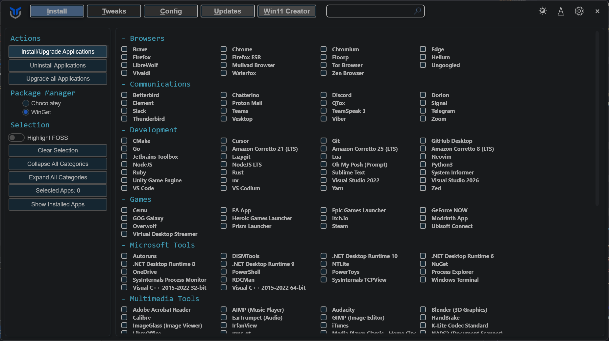
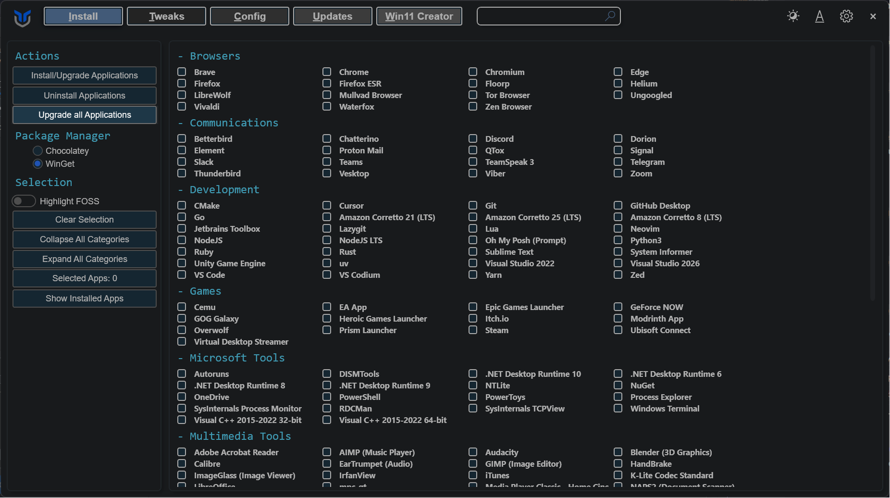
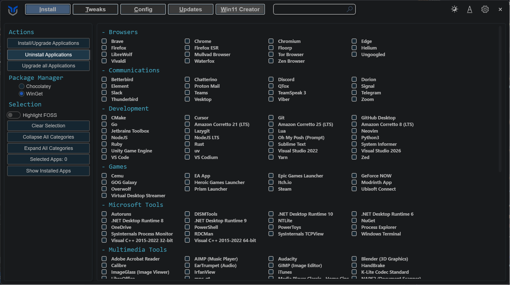
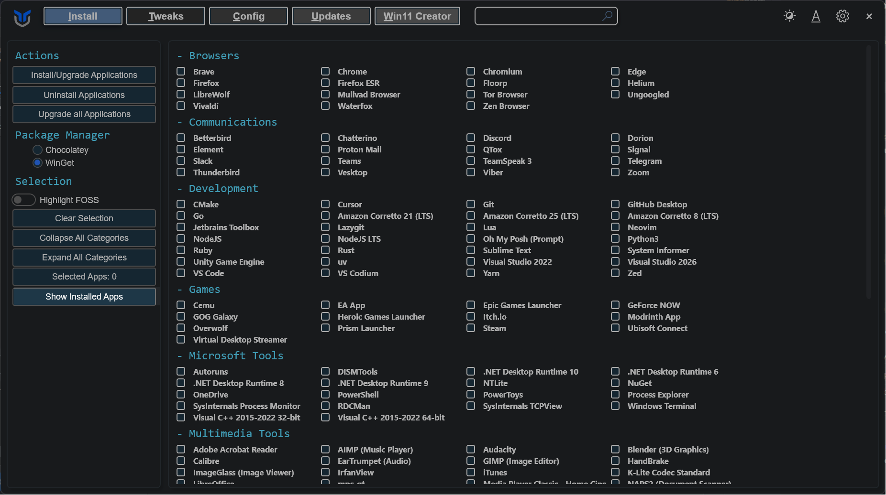
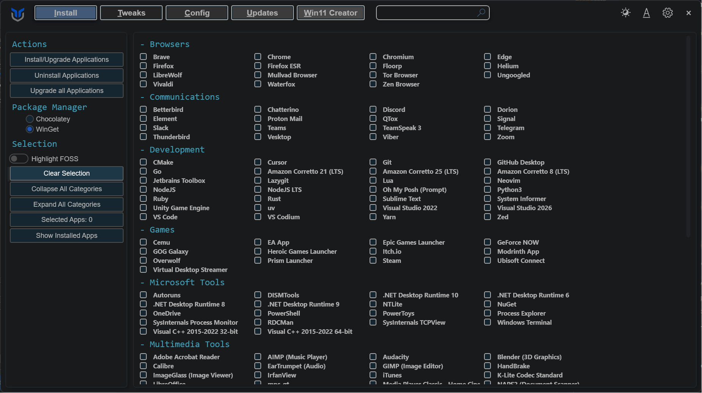

import { Tabs, TabItem } from '@astrojs/starlight/components';

Use the Applications tab to install, upgrade, uninstall, and review supported apps from one place. WinUtil relies on package manager support for these actions, so the available results depend on what WinGet can detect and manage on your system.

<Tabs>
<TabItem label="Installation & Updates">
* Choose the applications you want to install or upgrade.
    * For programs not currently installed, this action will install them.
    * For programs already installed, this action will update them to the latest version.
* Click the `Install/Upgrade Selected` button to start the installation or upgrade process.

</TabItem>
<TabItem label="Upgrade All">
* Simply press the `Upgrade All` button.
* This upgrades every supported installed program without individual selection.

</TabItem>
<TabItem label="Uninstall">
* Select the programs you wish to uninstall.
* Click the `Uninstall Selected` button to remove them.

</TabItem>
<TabItem label="Show Installed Apps">
* Click the `Show Installed Apps` button.
* This scans for and selects installed applications supported by WinGet.

</TabItem>
<TabItem label="Clear Selection">
* Click the `Clear Selection` button.
* This clears all current selections.

</TabItem>
</Tabs>

:::tip
If you have trouble finding an application, press `Ctrl + F` and search for its name. The list filters as you type.
:::

:::note
`Show Installed Apps` only selects software that WinGet can identify. Apps installed outside supported package sources may not appear.
:::

:::caution
Before uninstalling or upgrading apps, close any running programs first. Some packages may still prompt for input or fail if their source is unavailable.
:::
