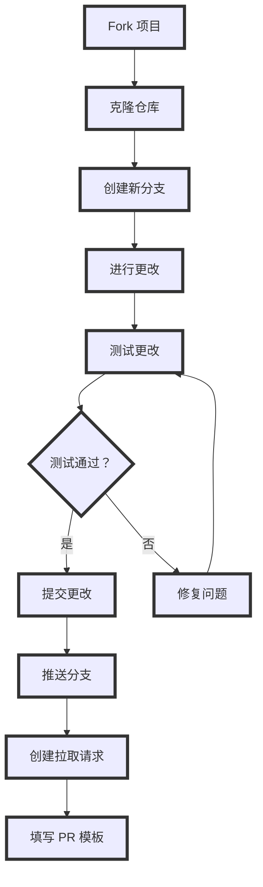
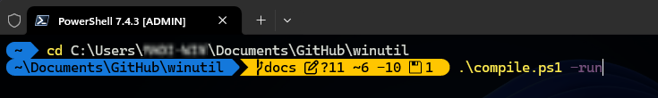
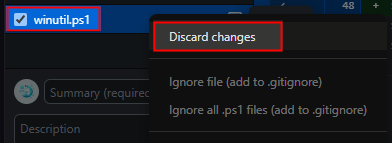
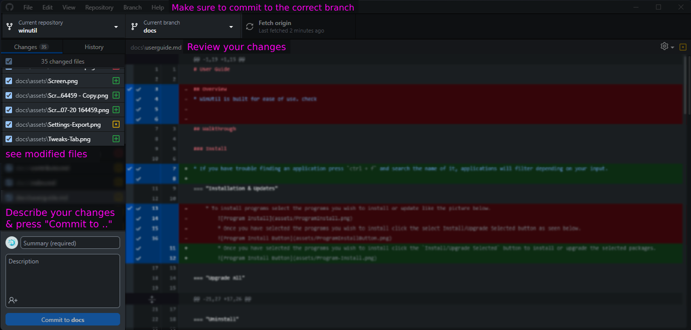
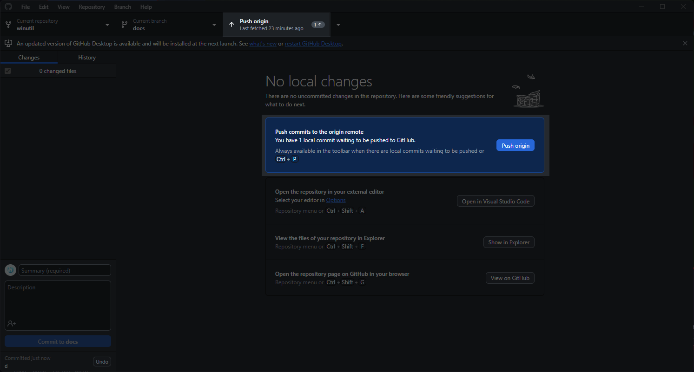

# 如何贡献？

## 测试

* 通过运行预发布版本来测试 WinUtil 的最新更改，并报告您遇到的问题，以帮助我们持续改进 WinUtil！

#### **运行最新的预发布版本**
   ```ps1
   irm https://christitus.com/windev | iex
   ```

!!! bug "请记住"

     这是一个预发布版本，应被视为预发布版本。它旨在让开发人员在将错误添加到稳定版本之前测试实用程序并报告或修复错误。请勿在生产环境中使用！

## 问题

* 如果您在使用脚本时遇到任何挑战或问题，我恳请您通过 GitHub 仓库上的“Issues”选项卡提交它们。通过填写提供的模板，您可以提供有关问题的具体详细信息，从而使我（以及社区中的其他人）能够及时解决任何错误或考虑功能请求。

## 贡献代码

* 拉取请求现在直接在 **MAIN 分支** 上处理。这样做是因为我们现在可以通过 GitHub 中的版本选择要启动的特定版本。

* 如果您要进行代码更改，那么您可以向 `main` 分支提交 PR，但我对此非常挑剔。

!!! warning "重要提示"

     请勿使用代码格式化程序、进行大量行更改或进行多个功能更改。每个功能更改都应该是其自己的拉取请求！

* 创建拉取请求时，必须彻底记录所有更改。这包括但不限于记录对 `tweaks` 部分所做的任何添加以及相应的 `undo tweak`，以便用户在必要时能够删除新添加的调整，并且所有代码更改都需要全面的文档。在您的拉取请求描述中记录您的更改并简要说明您进行更改的原因。不遵守此格式可能会导致拉取请求被拒绝。此外，任何缺乏足够文档的代码也可能被拒绝。

* 通过遵循这些准则，我们可以保持高质量标准，并确保代码库保持井然有序且文档齐全。

!!! note

     创建函数时，请在文件名中包含“WPF”或“WinUtil”，以便将其加载到运行空间中。

## 演练

* 这是针对初学者的指南。如果您仍有问题，请查看以下 GitHub 官方文档：
    * [通过 WEB 提交](https://docs.github.com/en/pull-requests/committing-changes-to-your-project/creating-and-editing-commits/about-commits)
    * [通过 GitHub Desktop 提交](https://docs.github.com/en/desktop/making-changes-in-a-branch/committing-and-reviewing-changes-to-your-project-in-github-desktop#about-commits)
    * [创建拉取请求](https://docs.github.com/en/pull-requests/collaborating-with-pull-requests/proposing-changes-to-your-work-with-pull-requests/creating-a-pull-request)


### 概述


!!! info

     这是一个指导您完成该过程的图表。根据您所做更改的类型，它可能会有所不同。

### Fork 仓库
* Fork WinUtil 仓库 [此处](https://github.com/ChrisTitusTech/winutil) 以创建将在您的仓库列表中可用的副本。


### 克隆 Fork
!!! tip

     虽然您可以直接通过 Web 进行更改，但我们建议使用应用程序 GitHub Desktop（在 WinUtil 中可用）将仓库克隆到您的设备，以便轻松测试您的 fork。

* 如果尚未安装 GitHub Desktop，请安装它。
* 使用您用于 fork WinUtil 的同一 GitHub 帐户登录。
* 在“您的仓库”下选择 fork，然后按“克隆 {repo name}”
* 创建一个新分支，并将其命名为与您的更改相关的内容。

* 现在，您可以使用您喜欢的文本编辑器根据自己的喜好修改 WinUtil。


### 测试您的更改

* 要测试您的更改是否按预期工作，请在 PowerShell 终端中以管理员身份运行以下命令：

* 将您运行命令的目录更改为 fork 的项目。
* `cd {path to the folder with the compile.ps1}`
* 运行以下命令以编译并运行 WinUtil：
* `.\Compile.ps1 -run`



* 在看到您的更改正常工作后，请随时将更改提交到仓库并创建 PR。有关帮助，请遵循以下文档。

### 提交更改
* 在提交更改之前，请放弃对 `winutil.ps1` 文件所做的更改，如下所示：



* 现在，一旦您对结果满意，就提交您的更改。



* 推送更改以将其上传到您在 github.com 上的 fork。



### 创建 PR
* 要在链接到主分支的新分支下的仓库上创建 PR，将显示一个按钮，并显示“预览并创建拉取请求”。单击该按钮并填写模板上提供的所有信息。正确填写所有信息后，检查您的 PR 以确保 PR 中未附加 WinUtil.ps1 文件。一切正常后，创建 PR 并等待 Chris（维护者）接受或拒绝您的 PR。一旦 Chris 接受，您将能够在“/windev”版本中看到您的更改。
* 如果您在主“/win”版本中没有看到您的功能，那也没关系。所有新更改都会进入 /windev 版本，以确保在完全公开之前一切正常。
* 恭喜！您刚刚提交了您的第一个 PR。非常感谢您为 WinUtil 做出贡献。
