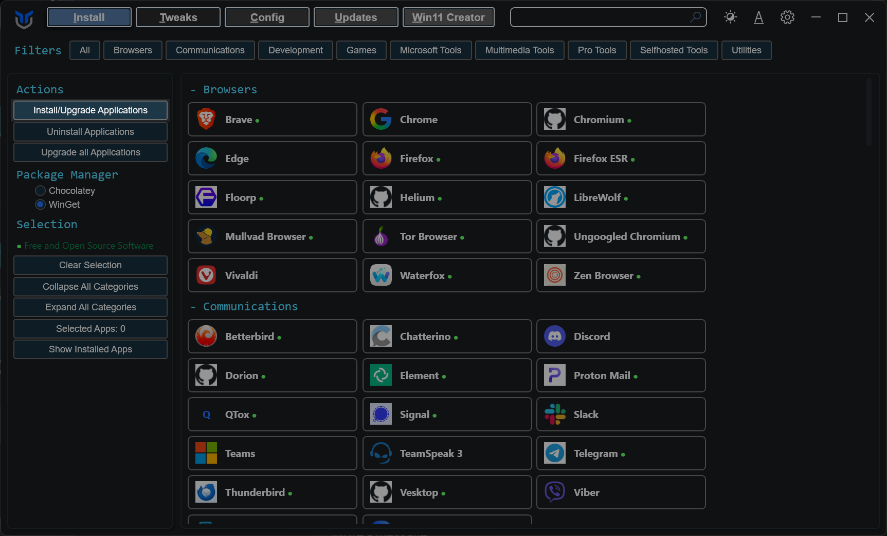
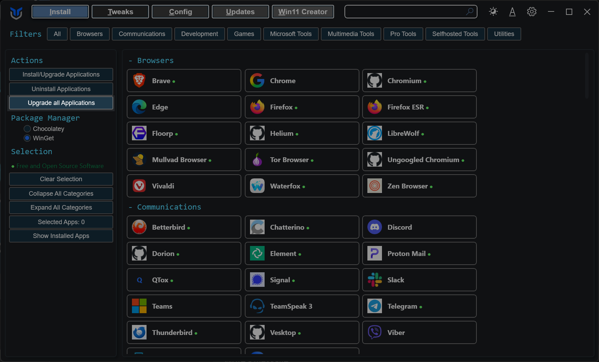
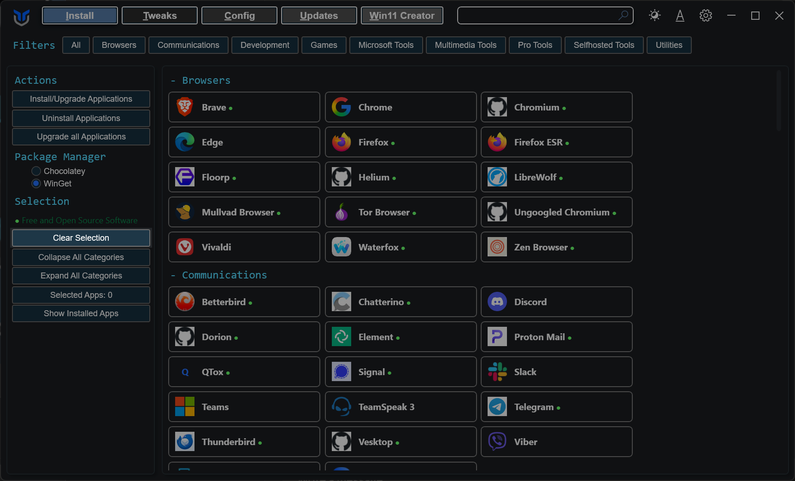
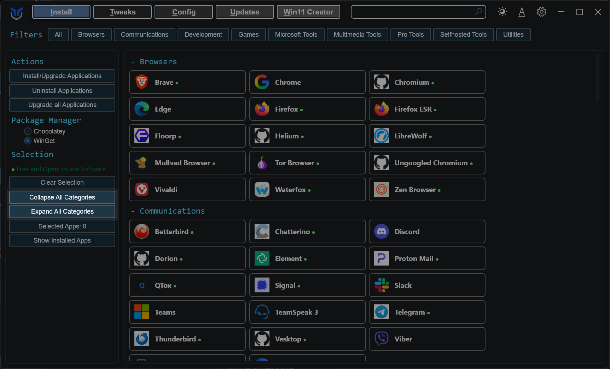
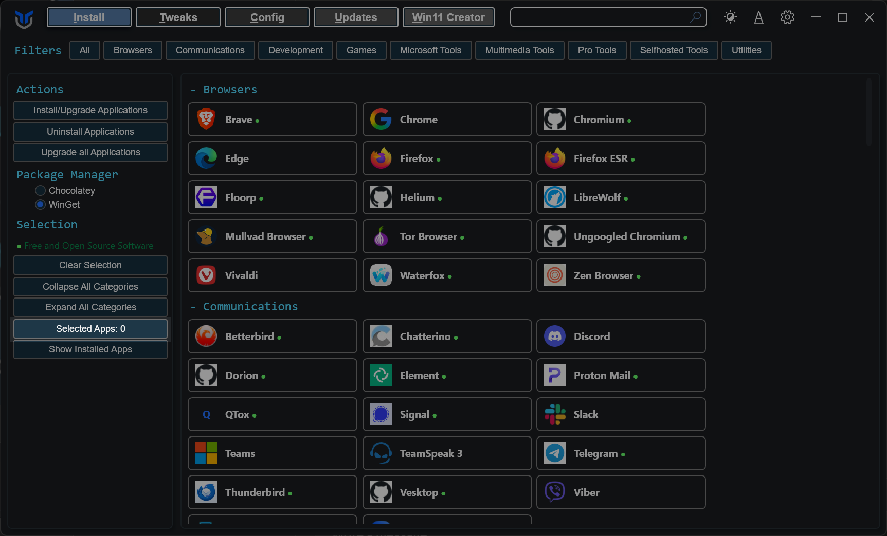
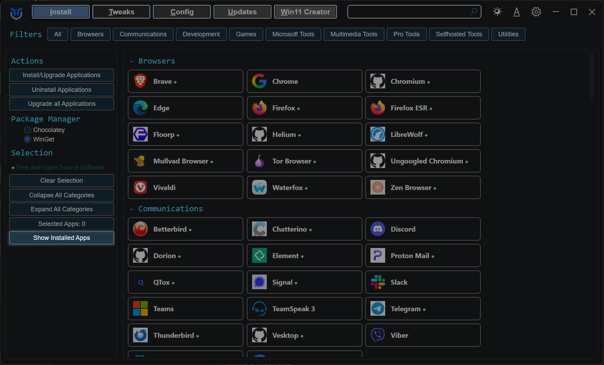

import { Tabs, TabItem } from '@astrojs/starlight/components';

Use the Applications tab to install, upgrade, uninstall, and review supported apps from one place. WinUtil relies on package manager support for these actions, so the available results depend on what WinGet can detect and manage on your system.

<Tabs>
<TabItem label="Install & Upgrade">
* Choose the applications you want to install or upgrade.
    * For programs not currently installed, this action will install them.
    * For programs already installed, this action will update them to the latest version.
* Click the `Install/Upgrade Selected` button to start the installation or upgrade process.

</TabItem>
<TabItem label="Uninstall">
* Select the programs you wish to uninstall.
* Click the `Uninstall Selected` button to remove them.

</TabItem>
<TabItem label="Upgrade All">
* Simply press the `Upgrade All` button.
* This upgrades every supported installed program without individual selection.

</TabItem>
<TabItem label="Clear Selection">
* Click the `Clear Selection` button.
* This clears all current selections.

</TabItem>
<TabItem label="Collapse & Expand Categories">
* Click `Collapse All Categories` to close every category and shrink the list to just the category headers.
* Click `Expand All Categories` to reopen every category and show all applications again.

</TabItem>
<TabItem label="Category Filters">
* Click a category chip at the top of the tab to show only that category. The chip stays highlighted while its filter is active.
* Hold `Ctrl` and click to add more categories to the filter, or to remove one again.
* Click `All`, or click the highlighted category again while it is the only one selected, to clear the filter.
* Categories with matching results open while a filter is active. Ones that filtering opened for you go back to collapsed when you clear it, ones you opened yourself stay open.
</TabItem>
<TabItem label="Selected Apps Counter">
* The `Selected Apps` counter in the sidebar shows how many applications are currently selected.
* Use it to keep track of your selection as you browse categories.

</TabItem>
<TabItem label="Show Installed Apps">
* Click the `Show Installed Apps` button.
* This scans for and selects installed applications supported by WinGet.

</TabItem>
</Tabs>

:::tip
If you have trouble finding an application, press `Ctrl + F` and search for its name. The list filters as you type. The search and the category chips work together, so you can search inside the categories you picked.
:::

:::note
`Show Installed Apps` only selects software that WinGet can identify. Apps installed outside supported package sources may not appear.
:::

:::caution
Before uninstalling or upgrading apps, close any running programs first. Some packages may still prompt for input or fail if their source is unavailable.
:::
