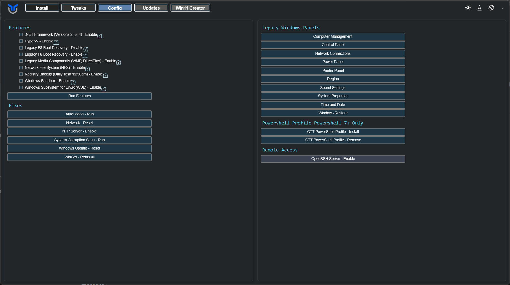

Use the **Features** and **Fixes** sections to install optional Windows components and run common repair tasks.

This page maps to the **Config** tab in WinUtil. Some actions complete immediately, while others may prompt, download files from Microsoft, or require a restart before the change is fully available.

## Windows Features

Install common **Windows features** by selecting the feature checkboxes and clicking **Install Features**.

If a feature depends on Windows installation media or optional downloads, Windows may take longer to finish or request a reboot.

* All .NET Frameworks (2, 3, 4)
* Hyper-V Virtualization
* Legacy Media (WMP, DirectPlay)
* NFS - Network File System
* Enable Daily Registry Backup Task 12:30 AM
* Enable Legacy F8 Boot Recovery
* Disable Legacy F8 Boot Recovery
* Windows Subsystem for Linux
* Windows Sandbox

## Fixes

Use these one-click fixes for common system problems.

Use these when you have a specific issue to correct, not as a routine cleanup step.

* Set Up Autologin
* Reset Windows Update
* Reset Network
* System Corruption Scan
* WinGet Reinstall

## Legacy Windows Panels

Open old-school Windows panels directly from WinUtil. Available panels include:

* Control Panel
* Network Connections
* Power Panel
* Region
* Sound Settings
* System Properties
* User Accounts

## Remote Access

Enable an OpenSSH server on your Windows machine for remote access.

Only enable this if you intend to use remote shell access. After turning it on, verify your firewall rules and account permissions before exposing the machine to other devices.

Because WinUtil runs elevated, the account it sets up is an administrator, and sshd reads administrator keys from `C:\ProgramData\ssh\administrators_authorized_keys` rather than from your profile. WinUtil creates that file and restricts it to Administrators and SYSTEM, which is what sshd requires. Add your public keys there. If an earlier WinUtil version changed `sshd_config` to read administrator keys from `%USERPROFILE%\.ssh\authorized_keys`, that is undone and any keys in it are copied across, so key auth keeps working.

Non-administrator accounts keep using `%USERPROFILE%\.ssh\authorized_keys` and need no extra setup.
