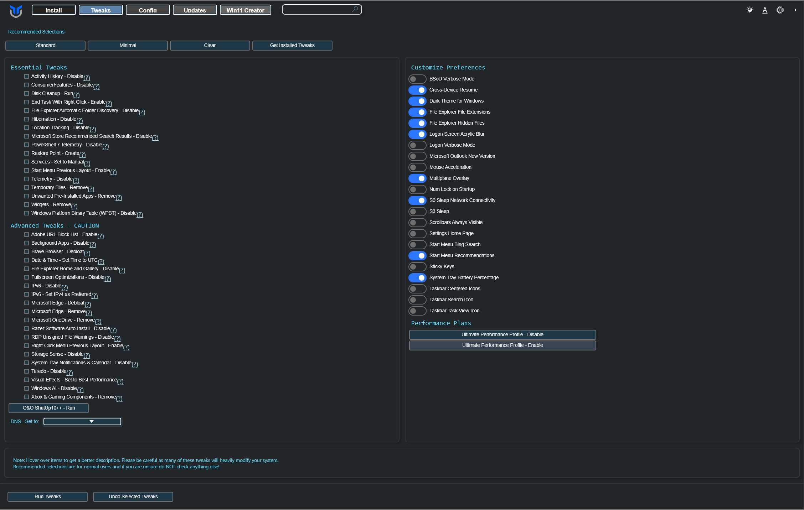

import YouTubeEmbed from '../../../components/YouTubeEmbed.astro';

Use the Tweaks tab to apply recommended Windows changes, review optional presets, and adjust a few supporting settings such as DNS and power plans. Start with a preset unless you already know which individual tweaks you want.

### Recommended Selections
Use the quick-selection buttons at the top of the Tweaks tab to speed up setup:

* **Standard**: Selects the recommended baseline set of tweaks for most users.
* **Minimal**: Selects a smaller, lower-impact set of common tweaks.
* **Advanced**: Selects a focused set of safer advanced tweaks. This preset intentionally skips restore point creation and cleanup tasks to avoid a long runtime.
* **Clear**: Clears all currently selected tweaks.
* **Get Installed Tweaks**: Best-effort detection for tweaks already applied to your system.

### Run Tweaks
* **Open the Tweaks tab**: Navigate to the **Tweaks** tab in the application.
* **Select Tweaks**: Choose the tweaks you want to apply. You can use the presets available at the top for convenience.
* **Run Tweaks**: After selecting the desired tweaks, click **Run Tweaks** at the bottom of the screen.

:::note
To see what each preset includes, view [preset.json](https://github.com/ChrisTitusTech/winutil/blob/main/config/preset.json).
:::

:::caution
Some tweaks take effect immediately, while others may require Explorer to restart, a sign-out, or a full reboot.
:::

### Undo Tweaks
* **Open the Tweaks tab**: Go to the **Tweaks** tab located next to **Install**.
* **Select Tweaks to Remove**: Choose the tweaks you want to disable or remove.
* **Undo Tweaks**: Click **Undo Selected Tweaks** at the bottom of the screen to apply the changes.

### AppX Packages

Open **AppX Removal** from the Tweaks tab to manage the listed Windows apps. Select one or more packages, then choose **Install Selected** or **Remove Selected**.

When installing a selected package, WinUtil first registers an existing local `AppxManifest.xml`. If no usable local manifest remains, WinUtil installs the package from the Microsoft Store through WinGet when a Store product ID is available.

During AppX installation or removal, the window-level progress bar shows the current package, completed package count, and overall progress. The Windows taskbar also reflects progress and the final success or failure state.

### Essential Tweaks
Essential Tweaks are the safest starting point for most systems. They focus on lower-risk changes that improve usability, reduce noise, and avoid the more invasive changes found in advanced options.

### Advanced Tweaks (CAUTION)
Advanced Tweaks are for users who understand the side effects of deeper Windows changes. Create a restore point first, review each item, and avoid treating the full advanced list as a one-click baseline.

### O&O ShutUp10++
[O&O ShutUp10++](https://www.oo-software.com/en/shutup10) can be launched from WinUtil with one click. It is a free privacy tool for Windows that helps users manage telemetry, update behavior, and app permission settings.

Watch a walkthrough:

<YouTubeEmbed id="3HvNr8eMcv0" title="O&O ShutUp10++ walkthrough" />

### DNS

Use the DNS section to switch both IPv4 and IPv6 DNS providers without editing adapter settings manually. Choose the option that best matches your priority: speed, filtering, or privacy.

* **Default**: Uses the default DNS settings configured by your ISP or network.
* **DHCP**: Automatically acquires DNS settings from the DHCP server.
* [**Google**](https://developers.google.com/speed/public-dns?hl=en): A reliable and fast DNS service provided by Google.
* [**Cloudflare**](https://developers.cloudflare.com/1.1.1.1/): Known for speed and privacy, Cloudflare DNS is a popular choice for enhancing internet performance.
* [**Cloudflare_Malware**](https://developers.cloudflare.com/1.1.1.1/setup/#:~:text=Use%20the%20following%20DNS%20resolvers%20to%20block%20malicious%20content%3A): Provides additional protection by blocking malware sites.
* [**Cloudflare_Malware_Adult**](https://developers.cloudflare.com/1.1.1.1/setup/#:~:text=Use%20the%20following%20DNS%20resolvers%20to%20block%20malware%20and%20adult%20content%3A): Blocks both malware and adult content, offering more comprehensive filtering.
* [**Open_DNS**](https://www.opendns.com/setupguide/#familyshield): Offers customizable filtering and enhanced security features.
* [**Quad9**](https://quad9.net/): Focuses on security by blocking known malicious domains.
* [**AdGuard_Ads_Trackers**](https://adguard-dns.io/en/welcome.html): AdGuard DNS blocks ads, trackers, and other unwanted DNS requests. Visit the website and sign in for a dashboard, statistics, and additional server-side customization.
* [**AdGuard_Ads_Trackers_Malware_Adult**](https://adguard-dns.io/en/welcome.html): AdGuard DNS blocks ads, trackers, malware, and adult content, and enables Safe Search and Safe Mode where possible.
* [**Mullvad**](https://mullvad.net/en/help/dns-over-https-and-dns-over-tls): Mullvad DNS without content blocking.
* [**Mullvad_Ads_Trackers**](https://mullvad.net/en/help/dns-over-https-and-dns-over-tls): Blocks ads and trackers.
* [**Mullvad_Ads_Trackers_Malware**](https://mullvad.net/en/help/dns-over-https-and-dns-over-tls): Blocks ads, trackers, and malware.
* [**Mullvad_Ads_Trackers_Malware_Social**](https://mullvad.net/en/help/dns-over-https-and-dns-over-tls): Blocks ads, trackers, malware, and social media.
* [**Mullvad_Ads_Trackers_Malware_Adult_Gambling**](https://mullvad.net/en/help/dns-over-https-and-dns-over-tls): Blocks ads, trackers, malware, adult content, and gambling.
* [**Mullvad_Ads_Trackers_Malware_Adult_Gambling_Social**](https://mullvad.net/en/help/dns-over-https-and-dns-over-tls): Applies all available Mullvad filters.

Mullvad profiles require DNS over HTTPS support in Windows. If the selected primary resolver is unavailable, WinUtil uses the closest Mullvad secondary resolver to preserve connectivity; that fallback may use a different filtering level and can be less restrictive.

### Customize Preferences

Use Customize Preferences for smaller visual and behavior changes that do not fit the main tweak presets.

### Performance Plans

Use Performance Plans to enable or remove the Ultimate Performance power profile.

#### Add and activate the Ultimate Performance Profile:
* Enables and activates the Ultimate Performance Profile to enhance system performance by minimizing latency and increasing efficiency.
#### Remove Ultimate Performance Profile:
* Deactivates the Ultimate Performance Profile, changing the system to the Balanced Profile.
