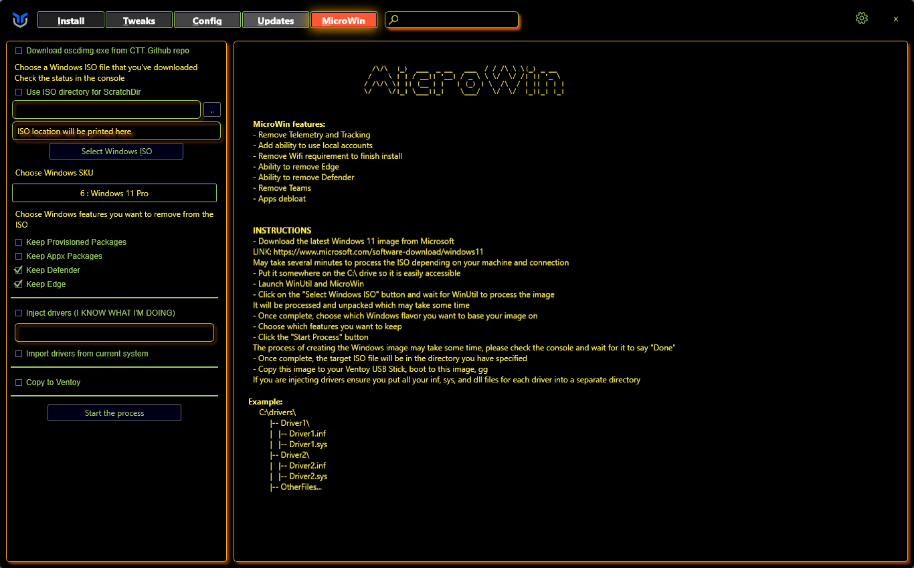
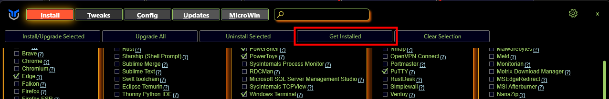
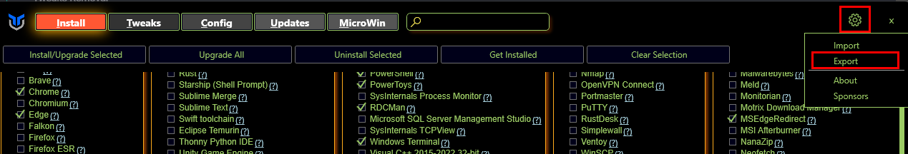

# User Guide

## Overview
* short one


## Walkthrough

### Program

#### Installation & Updates
* To install programs select the programs you wish to install or update like the picture below.

* Once you have selected the programs you wish to install click the select Install/Upgrade Selected button as seen below.


#### Upgrade All
* Press the button to upgrade all installed programs that are supported by WinGet, there is no selection needed.

#### Uninstall
* To uninstall programs select the programs you wish to uninstall like the picture below.

* Once you have selected the programs you wish to uninstall click the select Uninstall Selected button as seen below.


#### Get Installed
* Checks for installed programs that are supported by WinGet and selects them in the Utility.

#### Clear Selection
* Clears ur current selection so no program is checked.

### Tweaks

#### Tweaks Addition
* To enable tweaks on your system select Tweaks at the top next to Install.
* Then you can select what tweaks you want adding to your system. We do have some presets you can select from at the top you can see this in the picture below. 

* After you have chosen your tweaks click the Run Tweaks button at the bottom of the screen.

#### Tweaks Removal
* To disable tweaks on your system select Tweaks at the top next to Install.
* Then you can select what tweaks you want removing from your system.
* After you have chosen your tweaks you want to remove click the Undo Selected Tweaks button at the bottom of the screen.

#### Essential Tweaks
* The Tweaks under the Essential

#### Advanced Tweaks - CAUTION

#### O&O Shutup

#### DNS

#### Customize Preferences

#### Performance Plans

#### Shortcuts


### Config

#### Features
* Install the most used Windows Features by checking the checkbox and clicking "Install Features" to install them

#### Fixes
* Quick Fixes for your system if you are having Issues.

* Set Up Autologin
* Reset Windows Update
* Reset Network
* System Corruption Scan
* WinGet Reinstall
* Remove Adobe Creative Cloud

#### Legacy Windows Panels

### Updates | Not working rn

### MicroWin

**MicroWin** lets you customize your Windows 10 and 11 installation images by debloating them however you want.



#### Basic usage

1. Specify the source Windows ISO to customize

	* If you don't have a Windows ISO file prepared, you can download it using the Media Creation Tool for the respective Windows version. [Here](https://go.microsoft.com/fwlink/?linkid=2156295) is the Windows 11 version, and [here](https://go.microsoft.com/fwlink/?LinkId=2265055) is the Windows 10 version

2. Configure the debloat process
3. Specify the target location for the new ISO file
4. Let the magic happen!

**NOTE:** this feature is still in development and you may encounter some issues with the generated images. If that happens, don't hesitate to report an issue!

#### Options

* **Download oscdimg.exe from CTT GitHub repo** will grab a OSCDIMG executable from the GitHub repository instead of a Chocolatey package

	OSCDIMG is the tool that lets the program create ISO images. Typically, you would find this in the [Windows Assessment and Deployment Kit](https://learn.microsoft.com/en-us/windows-hardware/get-started/adk-install)

* Selecting a scratch directory will copy the contents of the ISO file to the directory you specify instead of an automatically generated folder on the `%TEMP%` directory
* You can select an edition of Windows to debloat (**SKU**) using the convenient drop-down menu

	By default, MicroWin will debloat the Pro edition, but you can choose any edition you want


##### Customization options

* **Keep Provisioned Packages**: leaving this option unticked (default) will try to remove every operating system package

	Some packages may remain after processing. This can happen if the packages in question were permanent ones or had been superseded by newer versions
	
* **Keep Appx Packages**: leaving this option unticked (default) will try to remove every Microsoft Store app from the Windows image

	This option will exclude some applications that are essential in the case that you want or need to add a Store app later on

* **Keep Defender**: leaving this option unticked will try to remove every part of Windows Defender, including the Windows Security app

	Leaving this option unticked is **NOT recommended** unless you plan to use a third-party antivirus solution on your MicroWin installation. On that regard, don't install AVs with bad reputation or rogueware
	
* **Keep Edge**: leaving this option unticked will try to remove every part of the Microsoft Edge browser using the best methods available

	Leaving this option unticked is not recommended because it might break some applications that might depend on the `Edge WebView2` runtime. However, if that happens, you can easily [reinstall it](https://developer.microsoft.com/en-us/microsoft-edge/webview2)


##### Driver integration options

* **Inject drivers** will add the drivers in the folder that you specify to the target Windows image
* **Import drivers from current system** will add every third-party driver that is present in your active installation

	This makes the target image have the same hardware compatibility of the active installation. However, this means that you will only be able to install the target Windows image and take full advantage of it on computers with **the same hardware**. To avoid this, you'll need to customize the `install.wim` file of the target ISO in the `sources` folder


##### Ventoy options

* **Copy to Ventoy** will copy the target ISO file to any USB drive with [Ventoy](https://ventoy.net/en/index.html) installed

	Ventoy is a solution that lets you boot to any ISO file stored in a drive. Think of it as having multiple bootable USBs in one. Do note though that your drive needs to have enough free space for the target ISO file
	

## Automation

* Some features are available through automation. This allows you to save your config file pass it to Winutil walk away and come back to a finished system. Here is how you can set it up currently with Winutil >24.01.15

* On the Install Tab, click "Get Installed", this will get all installed apps **supported by Winutil** on the system

* Click on the Settings cog in the upper right corner and chose Export, chose file file and location, this will export the setting file.

* Copy this file to a USB or somewhere you can use after Windows installation.
* Use Microwin tab to create a custom Windows image.
* Install the Windows image.
* In the new Windows, Open PowerShell in the admin mode and run command to automatically apply tweaks and install apps from the config file.
* ``` iex "& { $(irm christitus.com/win) } -Config [path-to-your-config] -Run" ```
* Have a cup of coffee! Come back when it's done.