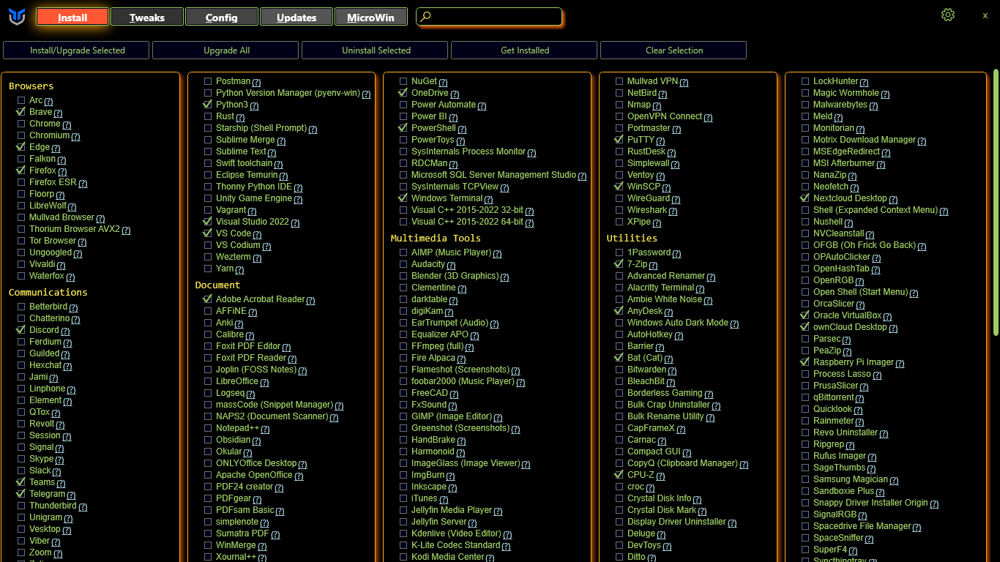
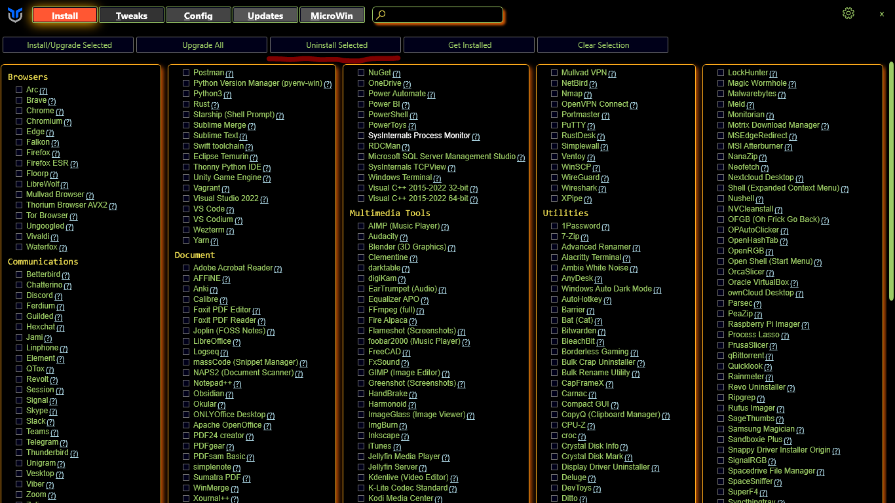
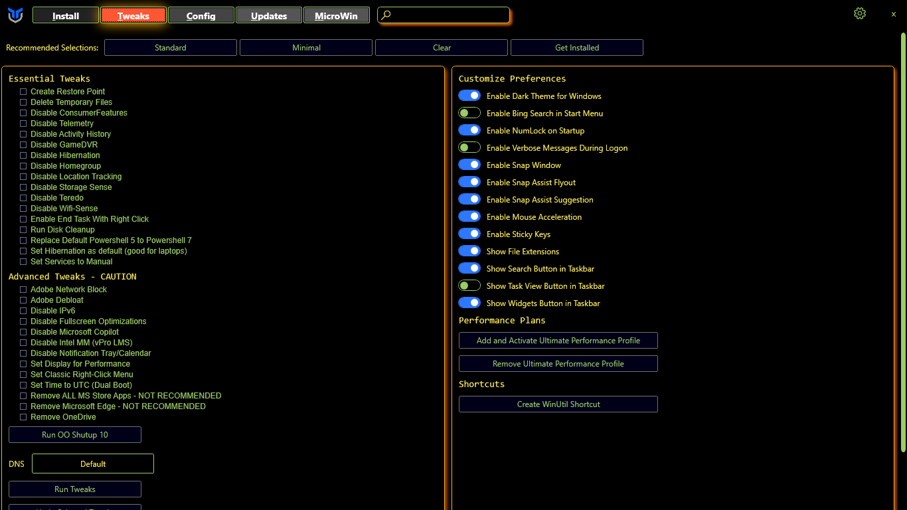

# User Guide

## Overview

## Program

### Installation & Updates
* To install programs select the programs you wish to install or update like the picture below.

* Once you have selected the programs you wish to install click the select Install/Upgrade Selected button as seen below.

### Upgrade All
* Press the button to upgrade all installed programs that are supported by WinGet, there is no selection needed.

### Uninstall
* To uninstall programs select the programs you wish to uninstall like the picture below.

* Once you have selected the programs you wish to uninstall click the select Uninstall Selected button as seen below.

### Get Installed
* Checks for installed programs that are supported by WinGet and selects them in the Utility.

### Clear Selection
* Clears ur current selection so no program is checked.

## Tweaks

### Tweaks Addition
* To enable tweaks on your system select Tweaks at the top next to Install.
* Then you can select what tweaks you want adding to your system. We do have some presets you can select from at the top you can see this in the picture below. 

* After you have chosen your tweaks click the Run Tweaks button at the bottom of the screen.

### Tweaks Removal
* To disable tweaks on your system select Tweaks at the top next to Install.
* Then you can select what tweaks you want removing from your system.
* After you have chosen your tweaks you want to remove click the Undo Selected Tweaks button at the bottom of the screen.

### Essential Tweaks
* The Tweaks under the Essential

### Advanced Tweaks - CAUTION

### O&O Shutup

### DNS

### Customize Preferences

### Performance Plans

### Shortcuts

## Config

### Features
* Install the most used Windows Features by checking the checkbox and clicking "Install Features" to install them

### Fixes
* Quick Fixes for your system if you are having Issues.

- Set Up Autologin
- Reset Windows Update
- Reset Network
- System Corruption Scan
- WinGet Reinstall
- Remove Adobe Creative Cloud

### Legacy Windows Panels

## Updates | Not working rn

## MicroWin